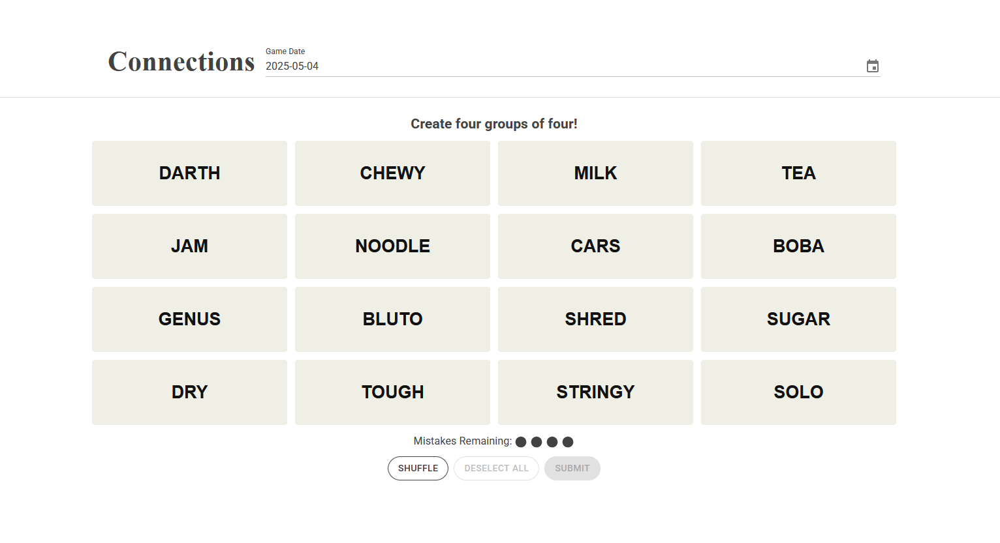
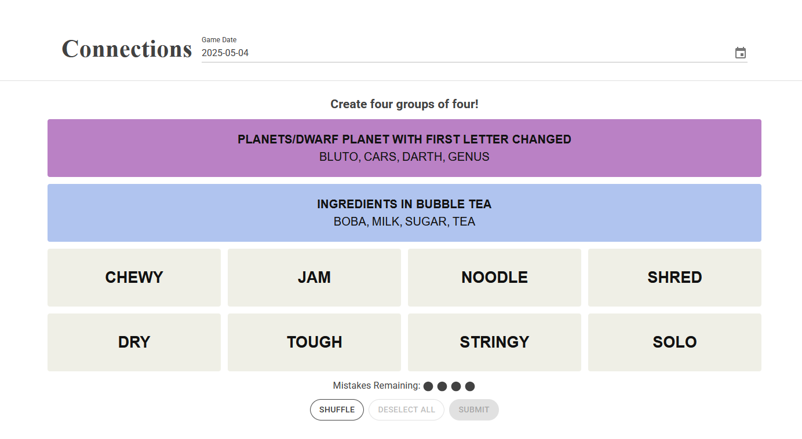
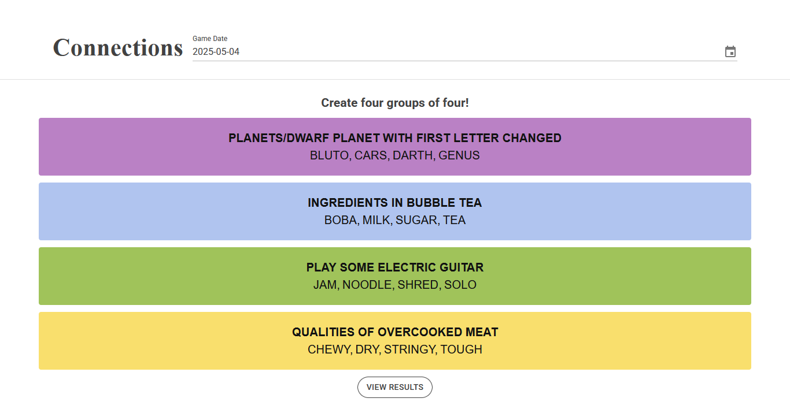
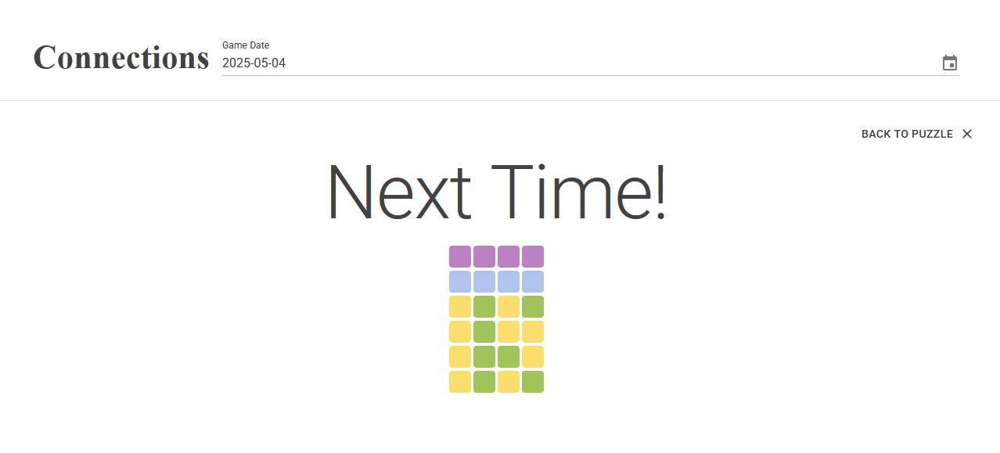

# BlazorConnections

BlazorConnections is a replica of the NYT Connections daily game built using Blazor and the MudBlazor component library

⚠️Originally used NYT Connections API is no longer available. This app will no longer work until a replacement is found⚠️

## Features

- **Date Selector**: Navigate to any valid date to play the NYT Connection of that day.
- **NYT Connection API**: Uses NYT Connection's api to get exact game data based on date chosen


## Getting Started

1. Clone the repository:
    ```bash
    git clone https://github.com/Videkourias/BlazorConnections.git
    cd BlazorConnections
    ```

2. Build the Docker image:
    ```bash
    docker build -t blazorconnections .
    ```

3. Run the Docker container:
    ```bash
    docker run -d -p 5000:8080 blazorconnections
    ```

4. Open your browser and navigate to `http://localhost:5000`.


## Screenshots






## License

This project is licensed under the [MIT License](LICENSE).
